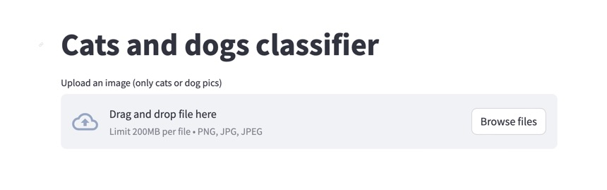
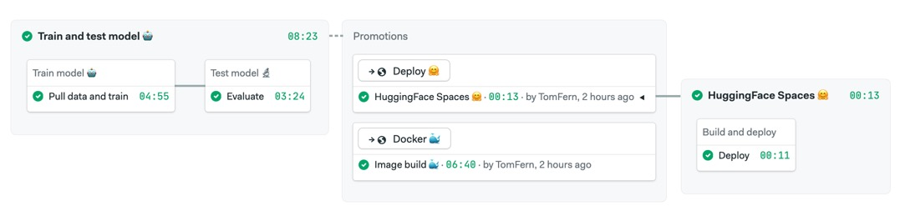

# Computer Vision Demo - DevOps for ML

[](https://semaphore-demos.semaphoreci.com/projects/semaphore-demo-mlops)

This repository contains everything needed to automate training, testing and deployment of an example ML model with DevOps tools and CI/CD.

The original code can be found in Kaggle.com. Feel free to copy the notebook and run it on the cloud to get familiar with the demo: 

<https://www.kaggle.com/code/tomasfern/cats-or-dogs-classifier>

## The Model

The base model is [resnet34](https://pytorch.org/vision/main/models/generated/torchvision.models.resnet34.html), a 34-layer Convolutional Neural Network (CNN) for Deep Residual Learning for Image Recognition. This repository fine-tunes the base model to classify images as dogs or cats.

## The Dataset

For fine-tuning, we'll use a subset of the [Oxfort IIIT Pets](https://www.robots.ox.ac.uk/~vgg/data/pets/) dataset. The subset uses about 1800 labeled images of dogs and cats. The labels are taken from the name of the file. For example:

`yorkshire_terrier_85.jpg`
    - The filename begins with **lowercase**, indicating it's a dog.
    - The words indicate the breed of the dog.
    - The number indicates the sample item.

`Russian_Blue_111.jpg`
    - The filename begins with **Uppercase**, indicating it's a cat.
    - The words indicate the breed of the cat.
    - The number indicates the sample item.

## The Application

We use [streamlit](https://streamlit.io/) to run a web application on top of the model.

## Branches

- `main`: the final state of the demo with CI/CD, DVC and ML pipelines.
- `noremote`: same as main but without the DVC remote (no AWS S3 bucket required).
- `initial`: the bare minimum to get started. No pipelines, no dvc installed.

## Prerequisites

Before starting, you'll need the folliwing tools:

- [DVC](https://dvc.org)
- Python 3 and pip
- Docker Desktop or Docker Engine
- Git and [Git-LFS](https://git-lfs.com/)

It is also recommended to sign up for free accounts on the following websites:

- [Kaggle.com](https://kaggle.com)
- [hub.docker.com](https://hub.docker.com)
- [HuggingFace.co](https://huggingface.co)

## Setup

1. Fork and clone this repository (branch=initial): `git clone -b initial https://github.com/<USERNAME>/semaphore-demo-mlops.git`
1. Create a virtualenv: `python -m venv .venv`
1. Activate it: `source .venv/bin/activate`
1. Install dependencies: `pip install -r requirements.txt`
1. Initialize the DVC repository: `dvc init`
1. Download the sample dataset: `wget https://huggingface.co/datasets/tomfern/oxford-pets-subset/resolve/main/images.tar.gz -O data/images.tar.gz`
    (alternative link: <https://www.kaggle.com/datasets/tomasfern/oxford-iiit-pets-subset>)
1. Ensure the downloaded tarball is located in `data/images.tar.gz`

## Manual finetuning and deployment

To train the model manually:

1. Run data prepare script (unpack tarball): `python src/prepare.py`
1. Run training script: `python src/train.py`
1. Run test script: `python src/test.py`

You should now have the models files in the `models/` directory.

You can now run the application with:

```bash
$ streamlit run src/app.py
```



Streamlit should open a browser window, you can upload pictures and get the model to classify them.

To run the application in a container:

```bash
$ docker build -t cats-and-dogs .
$ docker run -d -it -p 8501:8501 cats-and-dogs
```

Open your browser to <https://localhost:8501> to use the application.

To deploy the application to HugginFace Spaces:

1. Create a [HuggingFace](https://huggingface.co) account.
2. [Create a SSH keypair](https://docs.digitalocean.com/products/droplets/how-to/add-ssh-keys/create-with-openssh/) and [upload the public key](https://huggingface.co/docs/hub/security-git-ssh) to HugginFace.
3. Create a Streamlit Space on HuggingFace
4. Run the deployment script: 
    ```bash
    # eg ./deploy.sh https://huggingface.co/spaces/tomfern/cats-and-dogs /home/semaphore/.ssh/id_ed25519 
    ./deploy <huggingface_https_git_repo> <path_to_priv_key>
    ```
5. After a few minutes the application should be running in your Space.

## DVC Workflow

We'll use [DVC](https://dvc.org) to track datasets and automate the whole process.

First, download 

To setup a DVC ML Pipeline, use [dvc stage add](https://dvc.org/doc/command-reference/stage/add) like this:

```bash
# prepare stage
$ dvc stage add -n prepare \
    -d src/prepare.py \
    -o data/images \
    python src/prepare.py

# train stsage
$ dvc stage add -n train \
    -d src/train.py -d data/images \
    -o models/model.pkl -o models/model.pth \
    -m metrics/classification.md \
    --plots metrics/confusion_matrix.png \
    --plots metrics/top_losses.png \
    --plots metrics/finetune_results.png \
    python src/train.py

# test stage
$ dvc stage add -n test \
    -d src/test.py -d models/model.pkl -d models/model.pth \
    python src/test.py
```

This will create [dvc.yaml](https://dvc.org/doc/user-guide/project-structure/dvcyaml-files#dvcyaml). You can see the dependecy graph with:

```bash
$ dvc dag

+---------+
| prepare |
+---------+
      *
      *
      *
 +-------+
 | train |
 +-------+
      *
      *
      *
  +------+
  | test |
  +------+
``` 

To run the pipeline:

```bash
$ dvc repro
```

This will execute the required steps (ala Makefile) only. After each execution you should commit `dvc.yaml` and `dvc.lock` to preserve the state of the training in Git.

## CI/CD

To setup a CI/CD pipeline you'll need a few things:
- For containers, a token to access the Docker registry. For example, the user/password for a hub.docker.com account.
- For running the app in HuggingFace Spaces, you'll need to upload your SSH pubkey and install GIT LFS.

Example configuration with Semaphore CI/CD:

1. [Sign up](https://semaphoreci.com/signup) with GitHub for a *15-day trial* StartUp Semaphore account (the free account won't be enough)
1. Create [secrets](https://docs.semaphoreci.com/essentials/using-secrets/) for:
    - `dockerhub`: variables `DOCKER_USERNAME` and `DOCKER_PASSWORD`
    - `huggingface`: upload *private* SSH key to folder `/home/semaphore/.ssh/` (e.g `id_ed25519`)
    - `github`: variable `GITHUB_ACCESS_TOKEN` with write permission to public repos.
2. Add your project to Semaphore
3. In the test block of the CI pipeline enable the `github` secret.
4. Ensure the secrets names are correct
5. Update the environment varibles in the deploy pipeline. They must point to your priv SSH key and HuggingFace Git repository.
6. Push changes and see your pipeline flow.

The `main` branch includes an example pipeline to train, test, containerize and deploy your application.



## License

Copyright 2024 RenderedText

Permission is hereby granted, free of charge, to any person obtaining a copy of this software and associated documentation files (the “Software”), to deal in the Software without restriction, including without limitation the rights to use, copy, modify, merge, publish, distribute, sublicense, and/or sell copies of the Software, and to permit persons to whom the Software is furnished to do so, subject to the following conditions:

The above copyright notice and this permission notice shall be included in all copies or substantial portions of the Software.

THE SOFTWARE IS PROVIDED “AS IS”, WITHOUT WARRANTY OF ANY KIND, EXPRESS OR IMPLIED, INCLUDING BUT NOT LIMITED TO THE WARRANTIES OF MERCHANTABILITY, FITNESS FOR A PARTICULAR PURPOSE AND NONINFRINGEMENT. IN NO EVENT SHALL THE AUTHORS OR COPYRIGHT HOLDERS BE LIABLE FOR ANY CLAIM, DAMAGES OR OTHER LIABILITY, WHETHER IN AN ACTION OF CONTRACT, TORT OR OTHERWISE, ARISING FROM, OUT OF OR IN CONNECTION WITH THE SOFTWARE OR THE USE OR OTHER DEALINGS IN THE SOFTWARE.
